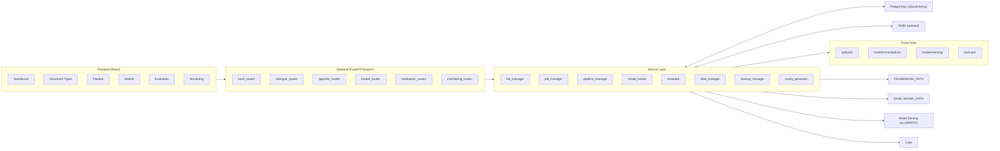
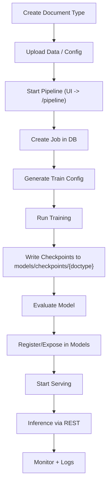
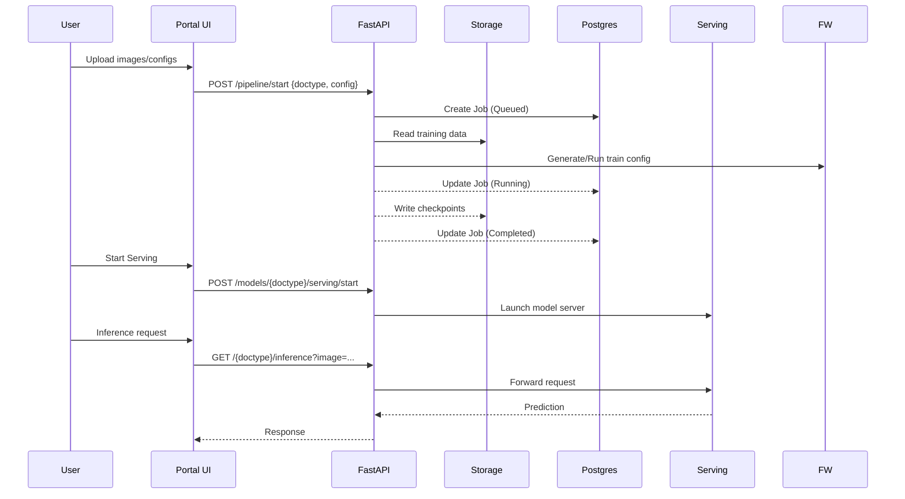
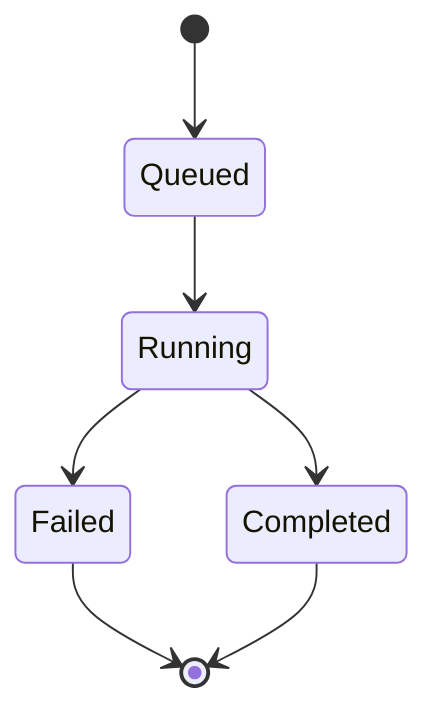

## Document Processing Portal – Pipeline Plan

### Audience
- Engineering, Ops, and Stakeholders who need a high‑level, visual overview of how the portal runs end‑to‑end.

### Goals
- Centralize dataset management, training, evaluation, and serving behind a single UI/API.
- Make reproducible runs with clear configs and artifacts.
- Provide observability for jobs and system health.

### Low‑Level Architecture (Components)


### Flow Chart (Operational)


### Data Flow (Happy Path)


### Job Lifecycle


### Environments & Configuration
- Config via `.env` and `backend/api/core/config.py`
- Key paths:
  - `UPLOAD_DIR`: user uploads
  - `MODELS_DIR`: `checkpoints/` and `serving/`
  - `FRAMEWORK_PATH`, `BASE_MODEL_PATH`: model framework roots
- Services:
  - PostgreSQL for jobs/metadata
  - Optional Redis for queuing

### Deployment Topology (SIT)
```mermaid
graph TD
  U[Users] -- HTTP/8000 --> P[Portal (FastAPI + UI)]
  P --> D[(PostgreSQL)]
  P --> R[(Redis)]
  P --> S[(Storage: /app/portal/data)]
  P --> F[(Framework: /app/meta-jv-reasoning/...)]
  P --> V[(Model Serving GPUs)]
```


