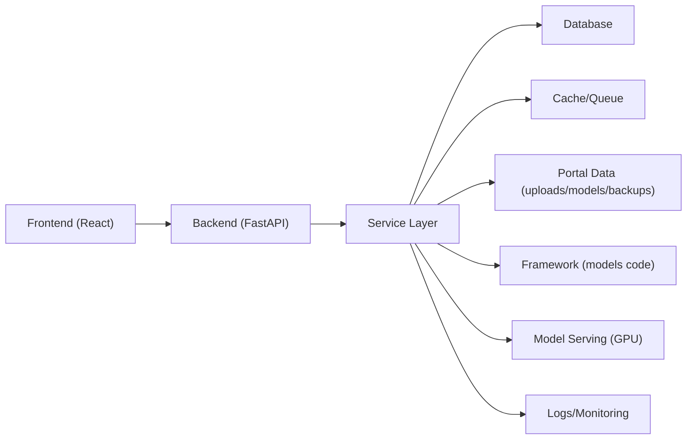
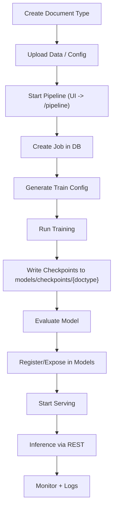
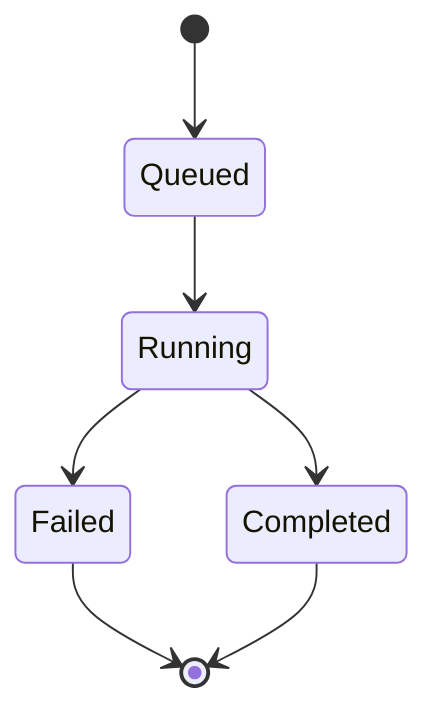

##  Pipeline Plan: Automated Model Training and Inferencing Portal  

Prepared by  Solomon Odum

### Goals
- Centralize dataset management, training, evaluation, and serving behind a single UI/API.
- Make reproducible runs with clear configs and artifacts.
- Provide observability for jobs and system health.

###  Architecture 

###  Operational Flow

### Data Flow

### Job Lifecycle

### Environments & Configuration
- Config via `.env` and `backend/api/core/config.py`
- Key paths:
  - `UPLOAD_DIR`: user uploads
  - `MODELS_DIR`: `checkpoints/` and `serving/`
  - `FRAMEWORK_PATH`, `BASE_MODEL_PATH`: model framework roots
- Services:
  - Database for jobs/metadata (e.g., PostgreSQL)
  - Cache/Queue for background work (e.g., Redis)
